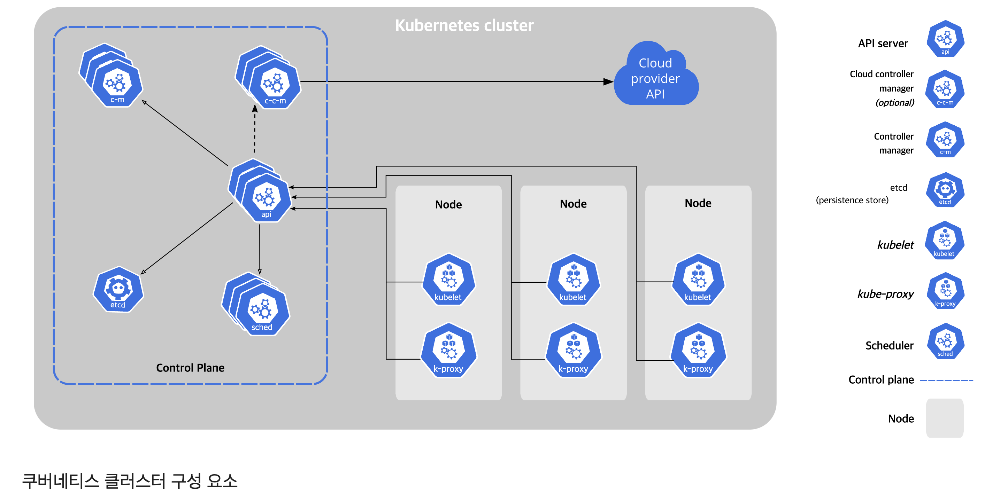

# 쿠버네티스 공식문서 정리

# 쿠버란

## 쿠버

쿠버네티스는 컨테이너화된 워크로드와 서비스를 관리하기 위한 이식성이 있고, 확장가능한 오픈소스 플랫폼이다. 쿠버네티스는 선언적 구성과 자동화를 모두 용이하게 해준다. 쿠버네티스는 크고, 빠르게 성장하는 생태계를 가지고 있다. 쿠버네티스 서비스, 기술 지원 및 도구는 어디서나 쉽게 이용할 수 있다.

쿠버네티스란 명칭은 키잡이(helmsman)나 파일럿을 뜻하는 그리스어에서 유래했다. K8s라는 표기는 "K"와 "s"와 그 사이에 있는 8글자를 나타내는 약식 표기이다. 구글이 2014년에 쿠버네티스 프로젝트를 오픈소스화했다. 쿠버네티스는 프로덕션 워크로드를 대규모로 운영하는 [15년 이상의 구글 경험](https://kubernetes.io/blog/2015/04/borg-predecessor-to-kubernetes/)과 커뮤니티의 최고의 아이디어와 적용 사례가 결합되어 있다.

## 쿠버의 여정

- 전통 배포의 시대
  - 하나의 물리 엔진에 여러개의 서비스를 배포
- 가상화된 배포 시대
  - 단일 물리 서버의 CPU에서 여러 가상 시스템 (VM)을 실행할 수 있게 한다. 가상화를 사용하면 VM간에 애플리케이션을 격리하고 애플리케이션의 정보를 다른 애플리케이션에서 자유롭게 액세스할 수 없으므로, 일정 수준의 보안성을 제공할 수 있다.
- 컨테이너 개발 시대
  - 컨테이너는 VM과 유사하지만 격리 속성을 완화하여 애플리케이션 간에 운영체제(OS)를 공유한다. 그러므로 컨테이너는 가볍다고 여겨진다. VM과 마찬가지로 컨테이너에는 자체 파일 시스템, CPU 점유율, 메모리, 프로세스 공간 등이 있다. 기본 인프라와의 종속성을 끊었기 때문에, 클라우드나 OS 배포본에 모두 이식할 수 있다.
  - 컨테이너의 장점
    - 기민한 애플리케이션 생성과 배포: VM 이미지를 사용하는 것에 비해 컨테이너 이미지 생성이 보다 쉽고 효율적이다.
    - 지속적인 개발, 통합 및 배포: 안정적이고 주기적으로 컨테이너 이미지를 빌드해서 배포할 수 있고 (이미지의 불변성 덕에) 빠르고 효율적으로 롤백할 수 있다.
    - 개발과 운영의 관심사 분리: 배포 시점이 아닌 빌드/릴리스 시점에 애플리케이션 컨테이너 이미지를 만들기 때문에, 애플리케이션이 인프라스트럭처에서 분리된다.
    - 가시성(observability): OS 수준의 정보와 메트릭에 머무르지 않고, 애플리케이션의 헬스와 그 밖의 시그널을 볼 수 있다.
    - 개발, 테스팅 및 운영 환경에 걸친 일관성: 랩탑에서도 클라우드에서와 동일하게 구동된다.
    - 클라우드 및 OS 배포판 간 이식성: Ubuntu, RHEL, CoreOS, 온-프레미스, 주요 퍼블릭 클라우드와 어디에서든 구동된다.
    - 애플리케이션 중심 관리: 가상 하드웨어 상에서 OS를 실행하는 수준에서 논리적인 리소스를 사용하는 OS 상에서 애플리케이션을 실행하는 수준으로 추상화 수준이 높아진다.
    - 느슨하게 커플되고, 분산되고, 유연하며, 자유로운 마이크로서비스: 애플리케이션은 단일 목적의 머신에서 모놀리식 스택으로 구동되지 않고 보다 작고 독립적인 단위로 쪼개져서 동적으로 배포되고 관리될 수 있다.
      - 리소스 격리: 애플리케이션 성능을 예측할 수 있다.
      - 리소스 사용량: 고효율 고집적.

## **쿠버네티스가 왜 필요하고 무엇을 할 수 있나 [](https://kubernetes.io/ko/docs/concepts/overview/#why-you-need-kubernetes-and-what-can-it-do)**

- 쿠버네티스는 분산 시스템을 탄력적으로 실행하기 위한 프레임 워크를 제공한다. 애플리케이션의 확장과 장애 조치를 처리하고, 배포 패턴 등을 제공한다. 예를 들어, 쿠버네티스는 시스템의 카나리아 배포를 쉽게 관리할 수 있다.
- 제공 기능
  - **서비스 디스커버리와 로드 밸런싱** 쿠버네티스는 DNS 이름을 사용하거나 자체 IP 주소를 사용하여 컨테이너를 노출할 수 있다. 컨테이너에 대한 트래픽이 많으면, 쿠버네티스는 네트워크 트래픽을 로드밸런싱하고 배포하여 배포가 안정적으로 이루어질 수 있다.
  - **스토리지 오케스트레이션** 쿠버네티스를 사용하면 로컬 저장소, 공용 클라우드 공급자 등과 같이 원하는 저장소 시스템을 자동으로 탑재할 수 있다
  - **자동화된 롤아웃과 롤백** 쿠버네티스를 사용하여 배포된 컨테이너의 원하는 상태를 서술할 수 있으며 현재 상태를 원하는 상태로 설정한 속도에 따라 변경할 수 있다. 예를 들어 쿠버네티스를 자동화해서 배포용 새 컨테이너를 만들고, 기존 컨테이너를 제거하고, 모든 리소스를 새 컨테이너에 적용할 수 있다.
  - **자동화된 빈 패킹(bin packing)** 컨테이너화된 작업을 실행하는데 사용할 수 있는 쿠버네티스 클러스터 노드를 제공한다. 각 컨테이너가 필요로 하는 CPU와 메모리(RAM)를 쿠버네티스에게 지시한다. 쿠버네티스는 컨테이너를 노드에 맞추어서 리소스를 가장 잘 사용할 수 있도록 해준다.
  - **자동화된 복구(self-healing)** 쿠버네티스는 실패한 컨테이너를 다시 시작하고, 컨테이너를 교체하며, '사용자 정의 상태 검사'에 응답하지 않는 컨테이너를 죽이고, 서비스 준비가 끝날 때까지 그러한 과정을 클라이언트에 보여주지 않는다.
  - **시크릿과 구성 관리** 쿠버네티스를 사용하면 암호, OAuth 토큰 및 SSH 키와 같은 중요한 정보를 저장하고 관리할 수 있다. 컨테이너 이미지를 재구성하지 않고 스택 구성에 시크릿을 노출하지 않고도 시크릿 및 애플리케이션 구성을 배포 및 업데이트할 수 있다.

## 쿠버네티스가 아닌 것

쿠버네티스는 전통적인, 모든 것이 포함된 Platform as a Service(PaaS)가 아니다. 쿠버네티스는 하드웨어 수준보다는 컨테이너 수준에서 운영되기 때문에, PaaS가 일반적으로 제공하는 배포, 스케일링, 로드 밸런싱과 같은 기능을 제공하며, 사용자가 로깅, 모니터링 및 알림 솔루션을 통합할 수 있다. 하지만, 쿠버네티스는 모놀리식(monolithic)이 아니어서, 이런 기본 솔루션이 선택적이며 추가나 제거가 용이하다. 쿠버네티스는 개발자 플랫폼을 만드는 구성 요소를 제공하지만, 필요한 경우 사용자의 선택권과 유연성을 지켜준다.

## [쿠버네티스 컴포넌트](https://kubernetes.io/ko/docs/concepts/overview/components/)

쿠버네티스를 배포하면 클러스터를 얻는다.

쿠버네티스 클러스터는 컨테이너화된 애플리케이션을 실행하는 [노드](https://kubernetes.io/ko/docs/concepts/architecture/nodes/)라고 하는 워커 머신의 집합. 모든 클러스터는 최소 한 개의 워커 노드를 가진다.

워커 노드는 애플리케이션의 구성요소인 [파드](https://kubernetes.io/ko/docs/concepts/workloads/pods/)를 호스트한다. [컨트롤 플레인](https://kubernetes.io/ko/docs/reference/glossary/?all=true#term-control-plane)은 워커 노드와 클러스터 내 파드를 관리한다. 프로덕션 환경에서는 일반적으로 컨트롤 플레인이 여러 컴퓨터에 걸쳐 실행되고, 클러스터는 일반적으로 여러 노드를 실행하므로 내결함성과 고가용성이 제공된다.

이 문서는 완전히 작동하는 쿠버네티스 클러스터를 갖기 위해 필요한 다양한 컴포넌트들에 대해 요약하고 정리한다.



## 컨트롤 플레인 컴포넌트

컨트롤 플레인 컴포넌트는 클러스터에 관한 전반적인 결정(예를 들어, 스케줄링)을 수행하고 클러스터 이벤트(예를 들어, 디플로이먼트의 `replicas` 필드에 대한 요구 조건이 충족되지 않을 경우 새로운 [파드](https://kubernetes.io/ko/docs/concepts/workloads/pods/)를 구동시키는 것)를 감지하고 반응한다.

컨트롤 플레인 컴포넌트는 클러스터 내 어떠한 머신에서든지 동작할 수 있다. 그러나 간결성을 위하여, 구성 스크립트는 보통 동일 머신 상에 모든 컨트롤 플레인 컴포넌트를 구동시키고, 사용자 컨테이너는 해당 머신 상에 동작시키지 않는다

### **kube-apiserver**

API 서버는 쿠버네티스 API를 노출하는 쿠버네티스 [컨트롤 플레인](https://kubernetes.io/ko/docs/reference/glossary/?all=true#term-control-plane) 컴포넌트이다. API 서버는 쿠버네티스 컨트롤 플레인의 프론트 엔드, 쿠버네티스 API 서버의 주요 구현은 [kube-apiserver](https://kubernetes.io/docs/reference/generated/kube-apiserver/) 이다. kube-apiserver는 수평으로 확장되도록 디자인되었다. 즉, 더 많은 인스턴스를 배포해서 확장할 수 있다. 여러 kube-apiserver 인스턴스를 실행하고, 인스턴스간의 트래픽을 균형있게 조절

### **etcd**

모든 클러스터 데이터를 담는 쿠버네티스 뒷단의 저장소로 사용되는 일관성·고가용성 키-값 저장소.

쿠버네티스 클러스터에서 etcd를 뒷단의 저장소로 사용한다면, 이 데이터를 [백업](https://kubernetes.io/docs/tasks/administer-cluster/configure-upgrade-etcd/#backing-up-an-etcd-cluster)하는 계획은 필수

### **kube-scheduler [](https://kubernetes.io/ko/docs/concepts/overview/components/#kube-scheduler)**

[노드](https://kubernetes.io/ko/docs/concepts/architecture/nodes/)가 배정되지 않은 새로 생성된 [파드](https://kubernetes.io/ko/docs/concepts/workloads/pods/) 를 감지하고, 실행할 노드를 선택하는 컨트롤 플레인 컴포넌트.

스케줄링 결정을 위해서 고려되는 요소는 리소스에 대한 개별 및 총체적 요구 사항, 하드웨어/소프트웨어/정책적 제약, 어피니티(affinity) 및 안티-어피니티(anti-affinity) 명세, 데이터 지역성, 워크로드-간 간섭, 데드라인을 포함

### **kube-controller-manager [](https://kubernetes.io/ko/docs/concepts/overview/components/#kube-controller-manager)**

[컨트롤러](https://kubernetes.io/ko/docs/concepts/architecture/controller/) 프로세스를 실행하는 컨트롤 플레인 컴포넌트.

논리적으로, 각 [컨트롤러](https://kubernetes.io/ko/docs/concepts/architecture/controller/)는 분리된 프로세스이지만, 복잡성을 낮추기 위해 모두 단일 바이너리로 컴파일되고 단일 프로세스 내에서 실행

- 노드 컨트롤러: 노드가 다운되었을 때 통지와 대응에 관한 책임을 가진다.
- 잡 컨트롤러: 일회성 작업을 나타내는 잡 오브젝트를 감시한 다음, 해당 작업을 완료할 때까지 동작하는 파드를 생성한다.
- 엔드포인트슬라이스 컨트롤러: (서비스와 파드 사이의 연결고리를 제공하기 위해) 엔드포인트슬라이스(EndpointSlice) 오브젝트를 채운다
- 서비스어카운트 컨트롤러: 새로운 네임스페이스에 대한 기본 서비스어카운트(ServiceAccount)를 생성한다.

### **cloud-controller-manager**

클라우드별 컨트롤 로직을 포함하는 쿠버네티스

[컨트롤 플레인](https://kubernetes.io/ko/docs/reference/glossary/?all=true#term-control-plane)

컴포넌트이다. 클라우드 컨트롤러 매니저를 통해 클러스터를 클라우드 공급자의 API에 연결하고, 해당 클라우드 플랫폼과 상호 작용하는 컴포넌트와 클러스터와만 상호 작용하는 컴포넌트를 구분할 수 있게 해 준다.

cloud-controller-manager는 클라우드 제공자 전용 컨트롤러만 실행한다. 자신의 사내 또는 PC 내부의 학습 환경에서 쿠버네티스를 실행 중인 경우 클러스터에는 클라우드 컨트롤러 매니저가 없다.

## 노드 컴포넌트

### **kubelet**

클러스터의 각 [노드](https://kubernetes.io/ko/docs/concepts/architecture/nodes/)에서 실행되는 에이전트. Kubelet은 [파드](https://kubernetes.io/ko/docs/concepts/workloads/pods/)에서 [컨테이너](https://kubernetes.io/ko/docs/concepts/containers/)가 확실하게 동작하도록 관리

### **kube-proxy**

kube-proxy는 클러스터의 각 [노드](https://kubernetes.io/ko/docs/concepts/architecture/nodes/)에서 실행되는 네트워크 프록시로, 쿠버네티스의 [서비스](https://kubernetes.io/ko/docs/concepts/services-networking/service/) 개념의 구현부이다.

[kube-proxy](https://kubernetes.io/ko/docs/reference/command-line-tools-reference/kube-proxy/)는 노드의 네트워크 규칙을 유지 관리한다. 이 네트워크 규칙이 내부 네트워크 세션이나 클러스터 바깥에서 파드로 네트워크 통신

### **컨테이너 런타임 [](https://kubernetes.io/ko/docs/concepts/overview/components/#%EC%BB%A8%ED%85%8C%EC%9D%B4%EB%84%88-%EB%9F%B0%ED%83%80%EC%9E%84)**

컨테이너 런타임은 컨테이너 실행을 담당하는 소프트웨어이다.

쿠버네티스는 [containerd](https://containerd.io/docs/), [CRI-O](https://cri-o.io/#what-is-cri-o)와 같은 컨테이너 런타임 및 모든 [Kubernetes CRI (컨테이너 런타임 인터페이스)](https://github.com/kubernetes/community/blob/master/contributors/devel/sig-node/container-runtime-interface.md) 구현체를 지원

## 애드온

### DNS

여타 애드온들이 절대적으로 요구되지 않지만, 많은 예시에서 필요로 하기 때문에 모든 쿠버네티스 클러스터는 [클러스터 DNS](https://kubernetes.io/ko/docs/concepts/services-networking/dns-pod-service/)를 갖추어야만 한다

### **웹 UI (대시보드)**

### **컨테이너 리소스 모니터링**

### **클러스터-레벨 로깅 [](https://kubernetes.io/ko/docs/concepts/overview/components/#%ED%81%B4%EB%9F%AC%EC%8A%A4%ED%84%B0-%EB%A0%88%EB%B2%A8-%EB%A1%9C%EA%B9%85)**

## [**쿠버네티스 API**](https://kubernetes.io/ko/docs/reference/using-api/)

쿠버네티스 [컨트롤 플레인](https://kubernetes.io/ko/docs/reference/glossary/?all=true#term-control-plane)의 핵심은 [API 서버](https://kubernetes.io/ko/docs/concepts/overview/components/#kube-apiserver)이다. API 서버는 최종 사용자, 클러스터의 다른 부분 그리고 외부 컴포넌트가 서로 통신할 수 있도록 HTTP API를 제공

쿠버네티스 API를 사용하면 쿠버네티스의 API 오브젝트(예: 파드(Pod), 네임스페이스(Namespace), 컨피그맵(ConfigMap) 그리고 이벤트(Event))를 질의(query)하고 조작할 수 있다.

대부분의 작업은 [kubectl](https://kubernetes.io/ko/docs/reference/kubectl/) 커맨드 라인 인터페이스 또는 API를 사용하는 [kubeadm](https://kubernetes.io/ko/docs/reference/setup-tools/kubeadm/)과 같은 다른 커맨드 라인 도구를 통해 수행할 수 있다. 그러나, REST 호출을 사용하여 API에 직접 접근

## [쿠버네티스 오브젝트](https://kubernetes.io/ko/docs/concepts/overview/working-with-objects/kubernetes-objects/)

이 페이지에서는 쿠버네티스 오브젝트가 쿠버네티스 API에서 어떻게 표현되고, 그 오브젝트를 어떻게 `.yaml` 형식으로 표현할 수 있는지에 대해 설명, 아래는 에시

```jsx
apiVersion: apps/v1
kind: Deployment
metadata:
  name: nginx-deployment
spec:
  selector:
    matchLabels:
      app: nginx
  replicas: 2 # tells deployment to run 2 pods matching the template
  template:
    metadata:
      labels:
        app: nginx
    spec:
      containers:
      - name: nginx
        image: nginx:1.14.2
        ports:
        - containerPort: 80

// 오브젝트 명세, 상태, 그리고 메타데이터에 대한 추가 정보 https://github.com/kubernetes/community/blob/master/contributors/devel/sig-architecture/api-conventions.md
```

동작

```jsx
kubectl apply -f https://k8s.io/examples/application/deployment.yaml
```

### 필드

생성하고자 하는 쿠버네티스 오브젝트에 대한 `.yaml` 파일 내, 다음 필드를 위한 값들을 설정해 줘야한다.

- `apiVersion` - 이 오브젝트를 생성하기 위해 사용하고 있는 쿠버네티스 API 버전이 어떤 것인지
- `kind` - 어떤 종류의 오브젝트를 생성하고자 하는지
- `metadata` - `이름` 문자열, `UID`, 그리고 선택적인 `네임스페이스`를 포함하여 오브젝트를 유일하게 구분지어 줄 데이터
- `spec` - 오브젝트에 대해 어떤 상태를 의도하는지

### 관리


3가지 방법이 있다

- 명령형 커맨드
  - kubectl create deployment nginx --image nginx
- 명령형 오브젝트 구성
  - 명령형 오브젝트 구성에서는 kubectl 커맨드로 작업(생성, 교체 등), 선택적 플래그, 그리고 최소 하나의 파일 이름을 지정한다. 그 파일은 YAML 또는 JSON 형식으로 오브젝트의 완전한 정의를 포함
  - kubectl create -f nginx.yaml
- 선언형 오브젝트 구성
  - 사용자는 로컬에 보관된 오브젝트 구성 파일을 대상으로 작동시키지만, 사용자는 파일에서 수행 할 작업을 정의하지 않는다. 생성, 업데이트, 그리고 삭제 작업은 `kubectl`에 의해 오브젝트마다 자동으로 감지된다. 이를 통해 다른 오브젝트에 대해 다른 조작이 필요할 수 있는 디렉터리에서 작업할 수 있다.
  ```
  kubectl diff -f configs/
  kubectl apply -f configs/
  ```

### 네임스페이스

쿠버네티스에서, *네임스페이스* 는 단일 클러스터 내에서의 리소스 그룹 격리 메커니즘을 제공한다. 리소스의 이름은 네임스페이스 내에서 유일해야 하며, 네임스페이스 간에서 유일할 필요

초기 네임스페이스 (4가지)

```yaml
default
kube-node-lease
kube-public
kube-system
```

# 클러스터 아키텍쳐

## 노드

쿠버네티스는 컨테이너를 파드내에 배치하고 *노드* 에서 실행함으로 워크로드를 구동한다. 노드는 클러스터에 따라 가상 또는 물리적 머신일 수 있다. 각 노드는 [컨트롤 플레인](https://kubernetes.io/ko/docs/reference/glossary/?all=true#term-control-plane)에 의해 관리되며 [파드](https://kubernetes.io/ko/docs/concepts/workloads/pods/)를 실행하는 데 필요한 서비스를 포함한다.

일반적으로 클러스터에는 여러 개의 노드가 있으며, 학습 또는 리소스가 제한되는 환경에서는 하나만 있을 수도 있다.

노드의 [컴포넌트](https://kubernetes.io/ko/docs/concepts/overview/components/#%EB%85%B8%EB%93%9C-%EC%BB%B4%ED%8F%AC%EB%84%8C%ED%8A%B8)에는 [kubelet](https://kubernetes.io/docs/reference/generated/kubelet), [컨테이너 런타임](https://kubernetes.io/ko/docs/setup/production-environment/container-runtimes/) 그리고 [kube-proxy](https://kubernetes.io/ko/docs/reference/command-line-tools-reference/kube-proxy/)가 포함된다.

### 관리

[API 서버](https://kubernetes.io/ko/docs/concepts/overview/components/#kube-apiserver)에 노드를 추가하는 두가지 주요 방법이 있다.

1. 노드의 kubelet으로 컨트롤 플레인에 자체 등록
2. 사용자(또는 다른 사용자)가 노드 오브젝트를 수동으로 추가
