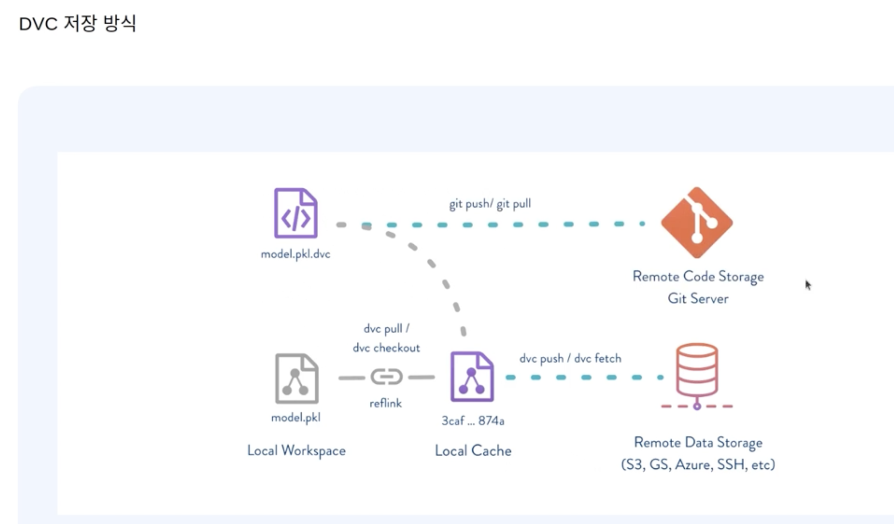

# MLOps의 구성요소 
# Data Management

- 가장 좋은 성능을 내는 피쳐 엔지니어링 기법을 선택해야하는데, 계속 실험을 하다보면, 데이터 여러 버전이 많이 쌓이게 되고, 관리가 어렵다
- 피쳐 엔지니어링을 거친 데이터인지 파일이름으로 관리하는것도 방법이지만, 효율적으로 관리할 수 있는 무료툴이 있음
- 소스코드를 잘 관리할 수 있도록 형상관리툴을 사용하고 있는데, 표준으로 상용되는게 Git이다. 또한 다른 사람과 협업하기 위해서는 깃험, 깃랩 등 플랫폼 서비스도 같이 활용한다.
- 단, 이러한 플랫폼 서비스들은 대용량 데이터를 올리고 다운로드 받기에는 적합하지 않다는 단점이 존재한다. 깃호스팅 서버들은 텍스트 파일정도만 올리는 용도에 적합하다. 
- 이러한 부분때문에 대용량 저장소에 업로드 해놓고, 깃헙에는 그 데이터를 다운 받을 수 있는 접속정보를 관리하지만 그래도 불편함이 존재
- 따라서 소스코드와 데이터 버전을 함께 관리하는 툴들이 존재하는데, 대표적으로 DVC, Paychyderm, Delta Lake, Dolt 툴들이 있다.


# DVC

- 실제 데이터는 스토리지에 저장되고, 깃헙 레포에는 데이터의 메타데이터만 저장하고 이걸 자동화해놓았다.
- 로컬에 다운 받을 때도, git pull 후에 dvc pull 만으로 간단하게 불러올 수 있다.
- dvc install
```shell
pip install dvc[all]==2.6.4

dvc --version
# 2.6.4

dvc --help
# 정상 설치되었는지 확인
```

- dvc setting
```shell
# STEP 1) 새로운 directory 를 만들고 이동
mkdir dvc-tutorial

cd dvc-tutorial

# STEP 2) git 저장소로 초기화
$ git init
Initialized empty Git repository in /Users/daisy/study/de-study/dvc-tutorial/.git/


# STEP 3) dvc 저장소로 초기화
$ dvc init
Initialized DVC repository.

You can now commit the changes to git.

+---------------------------------------------------------------------+
|                                                                     |
|        DVC has enabled anonymous aggregate usage analytics.         |
|     Read the analytics documentation (and how to opt-out) here:     |
|             <https://dvc.org/doc/user-guide/analytics>              |
|                                                                     |
+---------------------------------------------------------------------+

What's next?
------------
- Check out the documentation: <https://dvc.org/doc>
- Get help and share ideas: <https://dvc.org/chat>
- Star us on GitHub: <https://github.com/iterative/dvc>

```

- dvc 기본 명령어

```shell
# dvc tracing 할 데이터 생성
# data 를 저장할 용도로 data 라는 이름의 디렉토리를 생성하고 이동합니다.
mkdir data

cd data

# 가볍게 변경할 수 있는 데이터를 카피해오거나, 새로 만듭니다.
vi demo.txt

cat demo.txt
# Hello Fast Campus!

# 데이터 tracking
cd ..

dvc add data/demo.txt

# To track the changes with git, run:
git add data/demo.txt.dvc data/.gitignore

# dvc add
cd data
ls
# demo.txt.dvc 파일이 자동 생성된 것을 확인

cat demo.txt.dvc
# demo.txt 파일의 메타정보를 가진 파일입니다.
# git 에서는 demo.txt 파일이 아닌, demo.txt.dvc 파일만 관리하게 됩니다.

# git commit
git commit -m "Add demo.txt.dvc"

```
- .dvc 파일은 git push를 수행하여, git repository에 저장된다.
- data가 실제로 저장될 remote storage 세팅

```shell
$ dvc remote add -d storage gdrive://<GOOGLE_DRIVE_FOLDER_ID>
Setting 'storage' as a default remote.
# dvc 의 default remote storage 로 gdrive://<GOOGLE_DRIVE_FOLDER_ID> 를 세팅합니다.

$ cat .dvc/config
[core]
    remote = storage
['remote "storage"']
    url = gdrive://XXXXXXXXXX

# 데이터를 remote storage에 업로드
dvc push
```

- remote storage로 부터 데이터 다운로드
```shell
cd dvc-tutorial

# dvc 캐시를 삭제합니다.
rm -rf .dvc/cache/
# dvc push 했던 데이터를 삭제합니다.
rm -rf data/demo.txt

# dvc pull 로 google drive 에 업로드했던 데이터를 다운받습니다.
dvc pull

# 방금 다시 다운받은 데이터가 이전 데이터와 동일한지 확인합니다.
cat data/demo.txt
```

- 데이터 버전 변경
```shell
# 데이터를 변경합니다. (새로운 데이터를 같은 이름으로 copy 해와도 좋습니다.)
vi data/demo.txt

# 변경되었는지 확인합니다.
cat data/demo.txt

# dvc add (data/demo.txt.dvc 를 변경시켜주는 역할)
dvc add data/demo.txt

# git add and commit
git add data/demo.txt.dvc
git commit -m "update demo.txt"

# dvc push (and git push)
dvc push # 새로운 버전의 data 파일을 remote storage 에 업로드

(git push) # .dvc 파일을 git repository 에 업로드

```

- 데이터 롤백
```shell
# git log 를 확인합니다.
git log --oneline

# demo.txt.dvc 파일을 이전 commit 버전으로 되돌립니다.
git checkout <COMMIT_HASH> data/demo.txt.dvc

# dvc checkout 합니다. (demo.txt.dvc 의 내용을 보고 demo.txt 파일을 이전 버전으로 변경합니다.)
dvc checkout

# 데이터가 변경되었는지 확인합니다.
cat data/demo.txt
```